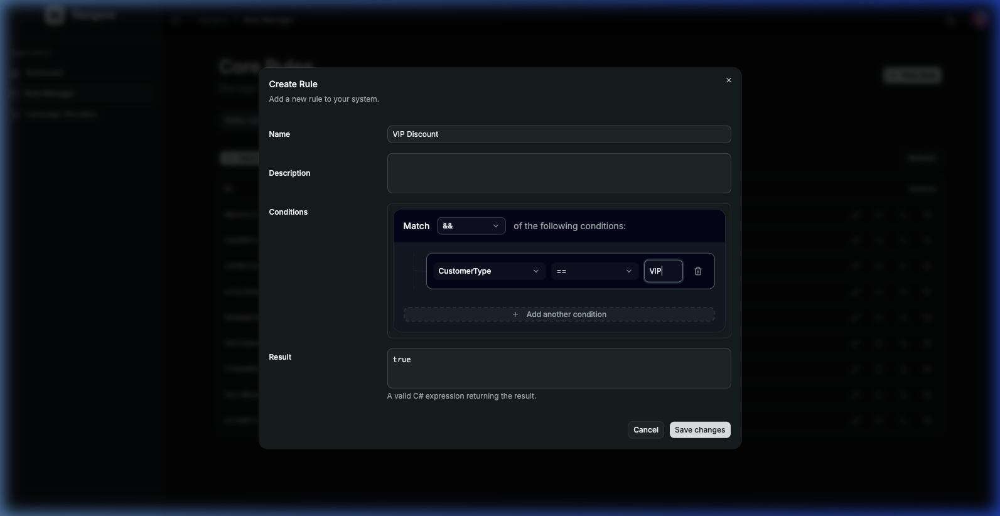
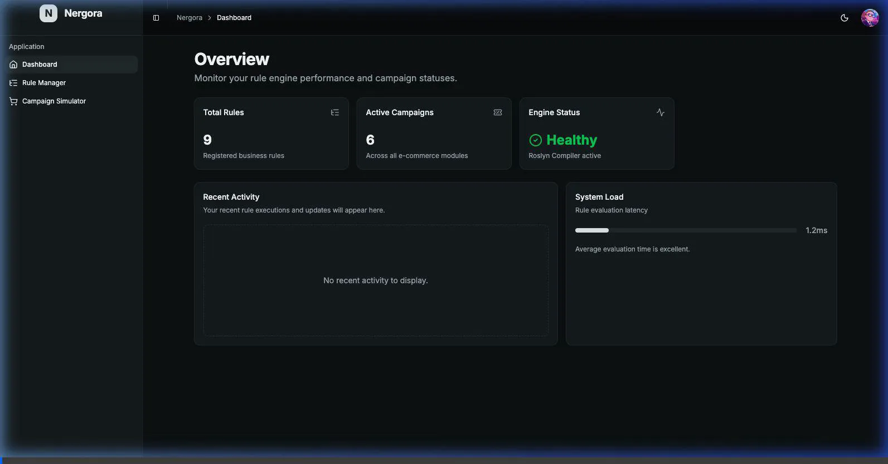
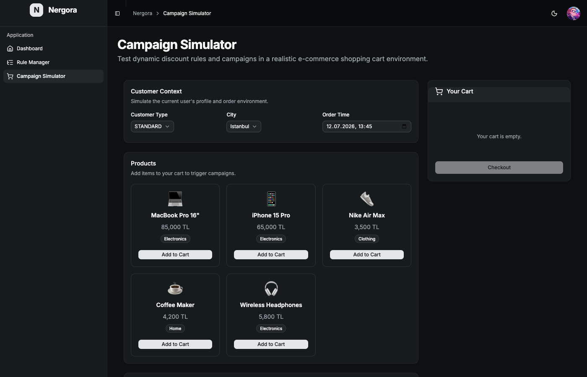

# Nergora Rule Manager

  

**Nergora Rule Manager** is a high-performance, dynamic C# rule engine powered by Roslyn Scripting. It allows you to store business rules, campaigns, and logical conditions as plain text in a database, compile them dynamically at runtime into highly efficient C# delegates, and execute them safely.

It comes with a fully responsive **Visual Rule Builder UI** (React/Vite) that makes it incredibly easy to define conditions without writing raw code.

## 🌟 Key Features

- **Dynamic Roslyn Compilation:** Write rules in pure C# strings. The engine compiles them to memory-efficient `Func<TInput, TOutput>` delegates at runtime.
- **Visual Rule Builder:** A modern React-based UI to visually construct logical rules (Match ALL / Match ANY) that are parsed back and forth from C#.
- **High Performance & Caching:** Compiled rules are cached in memory using `IMemoryCache`. Repeated evaluations run at near-native speed.
- **Dependency Injection (DI) Native:** Built strictly using Microsoft's `Microsoft.Extensions.DependencyInjection`, logging, and caching patterns. No dirty singletons or service locators.
- **Campaign Engine Add-on:** A higher-level abstraction for mapping business rules to user segments, applying scopes, and calculating rewards.
- **Thread-safe & Asynchronous:** Built from the ground up for concurrent, multi-threaded execution within web APIs.

---

## 📸 See it in Action

### Visual Rule Builder
The visual rule builder allows your business team to define conditions with a user-friendly UI. It automatically translates to valid C# for the backend to compile.



### Rule Creation Demo
Check out how easily rules can be configured and created via the front-end demo:



### Campaign Engine Simulator
The Campaign Engine sits on top of the Rule Engine to manage complex e-commerce scenarios. It evaluates the cart state in real-time, matching user attributes (like `CustomerType` or `City`) against rule sets to instantly apply discounts and campaigns.



---

## 🚀 How It Works

1. **Storage:** Rules are stored in your database (e.g., via EF Core).
2. **Compilation:** When a rule is evaluated for the first time, `RuleCompiler<TInput, TOutput>` utilizes `Microsoft.CodeAnalysis.CSharp.Scripting` to compile the string expression into a raw .NET delegate.
3. **Execution:** The compiled delegate is cached. Subsequent calls bypass compilation and execute in nanoseconds.
4. **Scope & Execution Context:** Variables are safely managed using `RuleScope` and `AsyncLocal` contexts to ensure thread safety across web requests.

---

## 💻 Code Examples

### 1. Registering the Engine

Add the rule engine to your DI container in `Program.cs`:

```csharp
// Add Core Rule Engine
builder.Services.AddRuleEngine();

// Add your custom repository implementation
builder.Services.AddScoped<IRuleRepository, EfRuleRepository>();

// (Optional) Add Campaign Engine layer
builder.Services.AddCampaignEngine();
```

### 2. Defining a Rule

A rule requires an input model, a predicate (condition), and a result.

```csharp
public class OrderInput : RuleInputModel 
{
    public decimal TotalAmount { get; set; }
    public string CustomerType { get; set; }
}

var ruleDef = new RuleDefinition 
{
    Id = "R1",
    Name = "VIP Discount Rule",
    Content = new RuleContent 
    {
        // Condition: Written in C#
        PredicateExpression = "Input.TotalAmount >= 100m && Input.CustomerType == \"VIP\"",
        // Result: What happens if condition is met
        ResultExpression = "new { Discount = 15m, FreeShipping = true }"
    }
};
```

### 3. Evaluating a Rule

Inject the engine (or evaluator) into your service and run your models against the rule:

```csharp
public class CheckoutService
{
    private readonly IRuleEvaluator _evaluator;

    public CheckoutService(IRuleEvaluator evaluator)
    {
        _evaluator = evaluator;
    }

    public async Task ApplyDiscount(OrderInput order)
    {
        // rule is fetched from repository
        var rule = await _repository.GetActiveVersionAsync("R1");
        var result = await _evaluator.EvaluateAsync(rule, order);

        if (result.Success && (bool)result.Metadata["PredicateMatched"])
        {
            Console.WriteLine($"Rule Passed! Result: {result.Result}");
        }
    }
}
```

---

## 🏗️ Architecture

The project is split into the following main modules:

- **`RuleEngine.Core`**: The foundation. Contains the Roslyn compiler, memory caching mechanisms, background `ProviderWorker`, and execution logic.
- **`CampaignEngine.Core`**: An abstraction layer built on top of `RuleEngine.Core` to manage marketing campaigns (scopes, multi-rule evaluation).
- **`RuleEngineDemo.Server`**: A full .NET 10 API implementation demonstrating how to wire everything up with Entity Framework Core and SQLite.
- **`ruleenginedemo.client`**: The React + Vite front-end that connects to the server and provides the visual rule builder.

## 🧪 Testing

The solution is highly tested with **xUnit** and **FluentAssertions**. The architecture avoids global static state variables to ensure safe parallel test execution.

To run the test suite:
```bash
dotnet test RuleEngine.sln -f net10.0
```

## 📝 License

This project is licensed under the MIT License.
