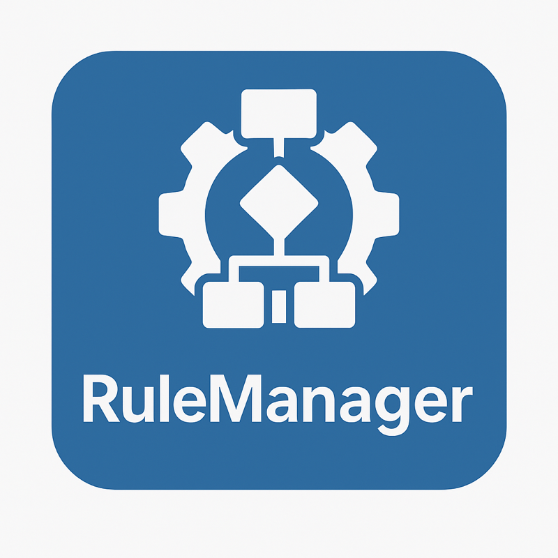

# RuleEngine & CampaignEngine

RuleEngine is an enterprise-ready NuGet package family for dynamic rule execution and campaign management in .NET. It provides Roslyn-based C# expression compilation, versioning, audit logging, .

## Why RuleEngine?

- High-performance compilation and caching
- Versioning, audit logs, and rollback
- Design-time metadata for rule editors
- DI friendly, multi-targeting (.NET 8/9/10)
- Campaign infrastructure (CampaignEngine.Core)

## Packages

- `Nergora.RuleEngine.Core` - Rule engine core
- `Nergora.CampaignEngine.Core` - Campaign engine

See `packages.en.html` for details.

## Quick Start

```bash
dotnet add package Nergora.RuleEngine.Core
```

```csharp
using RuleEngine.Core.Extensions;

var builder = WebApplication.CreateBuilder(args);
builder.Services.AddRuleEngine();
```

More: `getting-started.en.html`

## Documentation Map

- Getting started: `getting-started.en.html`
- Feature matrix: `features.en.html`
- Packages & versioning: `packages.en.html`
- Architecture: `architecture.en.html`
- RuleEngine.Core: `ruleengine-core.en.html`
- CampaignEngine.Core: `campaignengine-core.en.html`

- Rule authoring: `rule-authoring.en.html`
- Operations & performance: `operations.en.html`
- Security: `security.en.html`
- Release process: `release-process.en.html`
- Contributing: `contributing.en.html`
- Examples: `examples.en.html`

## Enterprise Readiness

- Release automation and versioning policy
- Audit logging and performance metrics
- Design-time metadata catalog
- Security policy and disclosure process

Next: `architecture.en.html`
